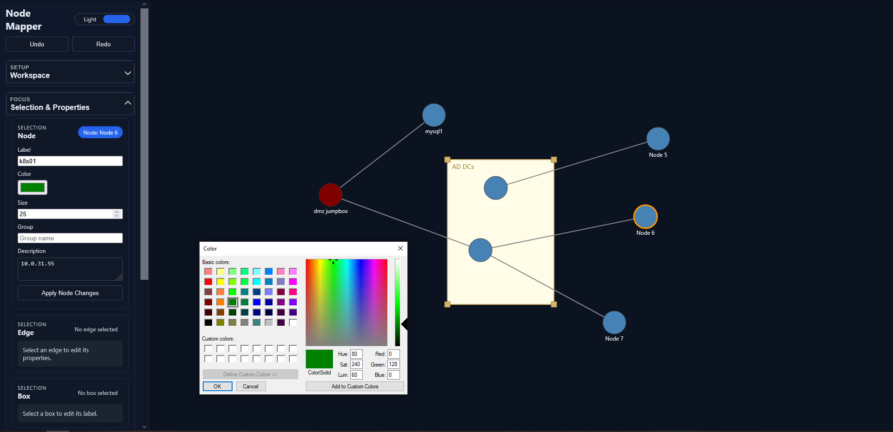
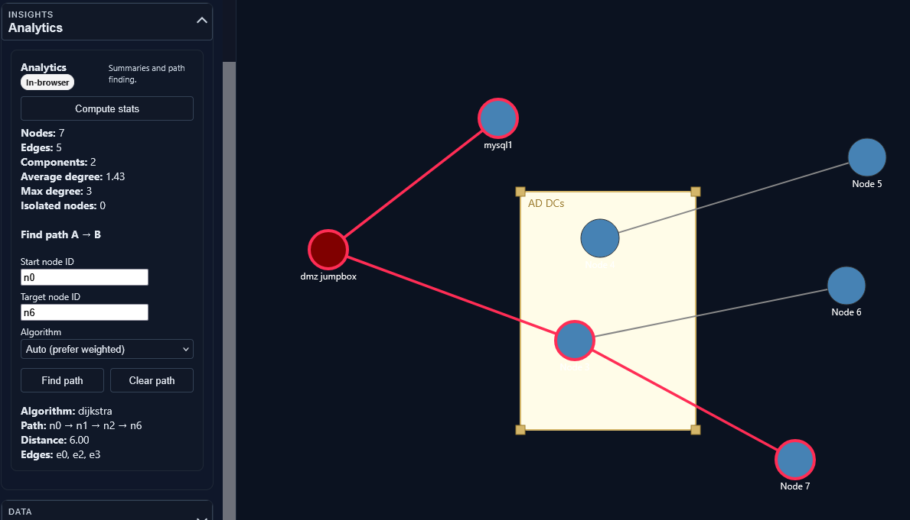

# Node Mapper

A lightweight Flask app that serves an in-browser graph editor. The editor lets you create nodes, connect them with edges, group related items into boxes, and experiment with multiple layout algorithms—all without a database or external services.



## Features
- **Interactive graph canvas:** Create, drag, delete, and connect nodes with mouse interactions.
- **Grouping with boxes:** Draw resizable boxes that move their contained nodes together.
- **Property editing:** Update labels, colors, sizes, descriptions, and grouping metadata for nodes; edit edge labels, widths, colors, and directionality; rename boxes.
- **Layouts:** Switch between manual positioning, force-directed, grid, circular, hierarchical, and weighted tree layouts (`static/layout.js`) with tunable spacing/radius/force controls.
- **Edge routing:** Choose straight or orthogonal edge routing to reduce visual clutter on dense graphs.
- **Search and filtering:** Hide non-matching nodes by label, description, or group.
- **Undo/redo:** In-browser undo stack for most actions.
- **Autosave and file I/O:** LocalStorage autosave plus export/import of graph JSON files, including layout settings and routing preferences.
- **Mini-map:** Overview map that reflects the current viewport and can re-center the main canvas.
- **Analytics:** Sidebar tools to compute graph metrics and find shortest paths (BFS or Dijkstra), with optional server-side computation for very large graphs.
- **Import/Export formats:** Load graphs from JSON, CSV edge lists, GraphML, or Graphviz DOT; export to JSON, CSV, GraphML, Graphviz DOT, Markdown/HTML reports, SVG, or PNG directly from the UI.



## Layout modes and parameters
- **Manual:** Drag items directly. Use the **Edges → Routing style** control to toggle straight vs. orthogonal segments.
- **Force layout:** Configure repulsion strength, ideal edge length, and iteration count for faster or looser packing.
- **Grid layout:** Control horizontal/vertical spacing for both boxes and unboxed nodes.
- **Circular layout:** Set inner and outer radii for box and node rings.
- **Hierarchical layout:** Adjust node spacing horizontally and vertically across BFS-like tiers.
- **Weighted tree:** Set tier count along with tier and node spacing for degree-weighted layers.

Layout and routing settings persist in `localStorage` and are bundled into JSON exports/imports so collaborators can reproduce the same view.

## Project structure
- `node_mapper.py` — Flask server exposing JSON endpoints and serving static assets.
- `static/index.html` — UI shell for the editor.
- `static/app.js` — Client-side logic for editing, rendering, and autosave.
- `static/layout.js` — Layout engines for arranging nodes and boxes.
- `static/styles.css` — Sidebar and canvas styling.

## Import / Export formats
Use the **Import / Export** section in the sidebar to choose a format, select a file, and download exports:

- **JSON:** Full graph (nodes, edges, boxes, layout settings). Uses the same structure as autosave exports.
- **CSV edge list:** Rows describing edges. Headers are optional; when present the parser looks for `source`, `target`, `label`, `width`, `color`, and `directed` columns.
  ```csv
  source,target,label,directed
  A,B,Depends on,true
  B,C,Uses,false
  ```
- **GraphML:** Basic GraphML with node/edge IDs. Edge direction uses the `<graph edgedefault>` attribute or per-edge `directed` attributes. Labels are pulled from `<data key="label">` (or `y:NodeLabel` when present).
  ```xml
  <graphml xmlns="http://graphml.graphdrawing.org/xmlns">
    <graph id="G" edgedefault="directed">
      <node id="A"><data key="label">Service A</data></node>
      <node id="B"><data key="label">Service B</data></node>
      <edge id="e1" source="A" target="B"><data key="label">Calls</data></edge>
    </graph>
  </graphml>
  ```
- **Graphviz DOT:** Import/export basic DOT. Export emits `digraph`/`graph` with node labels/fill colors and edge labels/colors; import reads `A -> B [label="…"]` (directed) and `A -- B` (undirected) statements, skipping graph-level attributes.
  ```dot
  digraph G {
    "A" [label="Service A"];
    "A" -> "B" [label="Calls"];
  }
  ```
- **Markdown report:** A paste-ready `.md` summary — graph metrics, top entities by degree, and the full edge list as Markdown tables.
- **SVG / PNG / HTML report:** Exports use the current SVG canvas (`#graphCanvas`) so visuals match what you see (including themes, labels, and routing). The HTML report adds a timestamp, summary metrics, top-entities and entity-type-breakdown tables, and is light/dark aware.
- **Filenames:** Downloads are named `node-mapper-[project-]YYYYMMDD-HHMM.ext` using the current project name when set.

## Running locally
1. Install Python 3.10+ and create a virtual environment:
   ```bash
   python -m venv .venv
   source .venv/bin/activate
   ```
2. Install dependencies (only Flask is required):
   ```bash
   pip install flask
   ```
3. Start the development server:
   ```bash
   python node_mapper.py
   ```
4. Open http://localhost:5000 in your browser.

The server uses an in-memory graph (`GRAPH` in `node_mapper.py`). Data is not persisted between restarts beyond the browser’s LocalStorage autosave.

## Link-analysis features
Beyond plain diagramming, Node Mapper now works as a lightweight link-analysis tool:
- **Typed entities:** every node is an instance of an entity type defined in `static/entities.js` (250+ types), each with an icon, color, default shape, a primary `value`, and a typed property schema. The library spans OSINT/identity/network plus **program & data flow** (UML structural & behavioral, flowchart, DFD) and **cloud environments** — compute/serverless (Lambda, EC2, containers), storage & data (S3, RDS, DynamoDB, queues/streams), networking (VPC, subnets, IGW, NAT/VPN/Transit gateways, load balancers, Route53, API Gateway, WAF), Kubernetes (pods, deployments, services, ingress…), IAM/security, DevOps, and observability. Drag a type from the categorized, searchable **Entity Palette**, or change a node's type in the property editor (with advisory value validation).
- **Transforms:** right-click an entity (or use the **Transforms** tab) to run a transform that queries the server and expands the graph with new connected entities. Results merge additively, de-duplicate by type+value, and are tagged with provenance. Demo transforms run offline (synthetic data) via `/api/transform` and cover domain/host → IP, emails, subdomains, URLs, WHOIS; IPv4 → ports, reverse-IP domains, owning organization/ASN, and geolocation; and person → emails and social-profile URLs.
- **Centrality & communities:** the **Analytics** tab computes degree / betweenness / closeness / PageRank with a ranked table, plus label-propagation communities. The **View** tab can color/size nodes by any metric or by community (data-driven encoding), with an on-canvas legend.
- **Investigation workflow:** marquee select, copy/paste/duplicate, group/ungroup, double-click rename, right-click context menus, N-hop neighborhood selection, shortest paths by clicking endpoints, and pinned nodes excluded from layouts.
- **Projects & collaboration:** save named projects/cases to the server (SQLite) with version history, optional account login, and autosave. Anonymous use keeps working without an account.

## API endpoints
- `GET /graph`, `GET /`, `GET /static/*` — graph + front-end assets.
- `POST /analytics` — stats + shortest path (BFS/Dijkstra) for large graphs.
- `POST /api/centrality` — degree/betweenness/closeness/PageRank + communities.
- `GET /api/transforms`, `POST /api/transform` — list / run transforms.
- `GET|POST /api/projects`, `GET|PUT|DELETE /api/projects/<id>`, `GET /api/projects/<id>/versions`, `POST /api/projects/<id>/versions/<vid>/restore` — project/case persistence + history.
- `POST /api/register`, `POST /api/login`, `POST /api/logout`, `GET /api/me` — optional session auth.

Set `FLASK_DEBUG=1` to enable the dev debugger (off by default); `HOST`/`PORT` override the bind address.

## Testing
- JavaScript (layout engines + entity registry): `npm test` — uses Node's built-in test runner, no dependencies.
- Python (server analytics, centrality, transforms, projects): `pip install pytest && python -m pytest -q tests`.

## Analytics
- Use the **Analytics** panel in the sidebar to compute node/edge counts, component counts, average/max degree, isolated node totals, graph **density**, **self-loop** counts, and (for small graphs) the **diameter** and **average shortest-path length** of the largest component. The same metrics are mirrored by the server `/analytics` endpoint for large graphs.
- Enter two node IDs to run **Find path A→B** using BFS (unweighted) or Dijkstra (weighted) shortest paths; paths highlight on the canvas.
- For large graphs (default: 500+ nodes), analytics requests automatically fall back to the Flask `/analytics` endpoint to avoid blocking the browser.

## Usage tips
- Use the **Modes** section to switch between selecting, creating nodes, linking nodes, deleting, or drawing boxes.
- Apply **Layouts** to reposition content automatically; manual tweaks are preserved until the next layout run.
- The **Mini-map** is clickable—use it to jump the viewport to a new area.
- Autosave writes to `localStorage` under the `graph-autosave-v1` key; use **Load Autosave** to restore it after a refresh.
